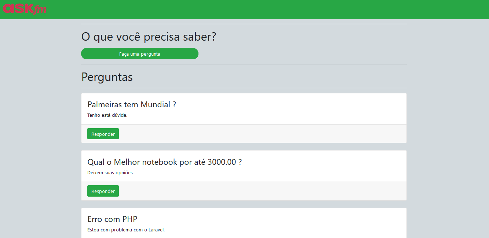

# Ask and Answer
> Plataforma de perguntas e respostas.

Plataforma simples de perguntas e responsas com base no ask.fm

## Exemplo de uso

Dentro da plataforma, você faz uma pergunta, acessa a pergunta e vê as respotas.

## Tecnologias utilizadas

* NodeJS + Express
* EJS
* Bootstrap
* MySql

